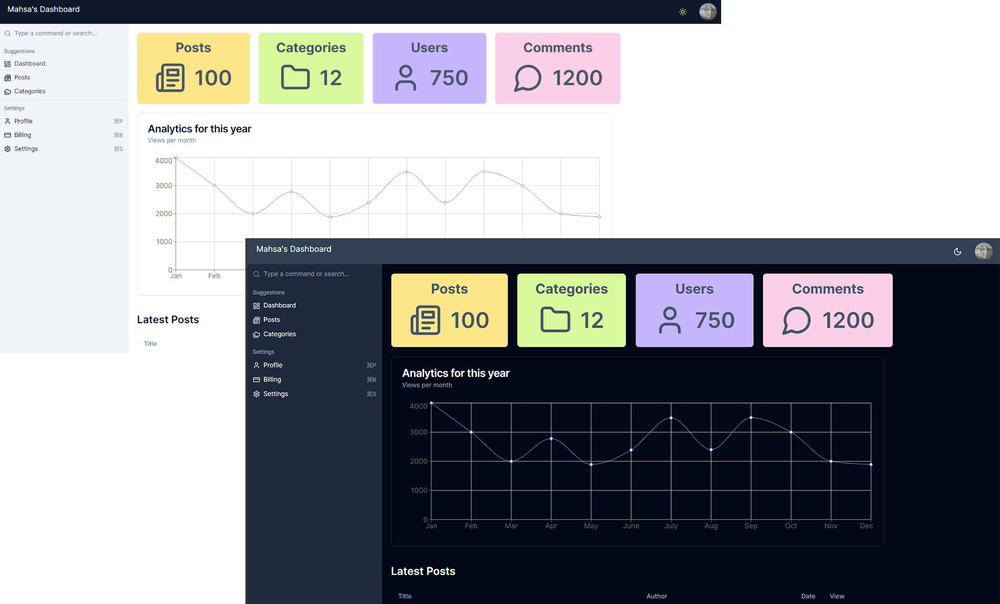

# Admin Dashboard App

Welcome to the Admin Dashboard App! This application is designed for efficient administrative management with a modern, responsive UI. It uses Next.js, React, and Tailwind CSS among other tools to deliver a powerful and user-friendly experience.

---

## 📸 Preview



---

## 🛠️ Tech Stack

- **Framework**: Next.js (React)
- **Styling**: Tailwind CSS, Radix UI
- **Data Visualization**: Recharts
- **Forms**: React Hook Form with Zod for validation
- **Theming**: Next Themes (dark/light mode support)
- **State Management**: React hooks and context API

---

## 🎯 Features

- **Responsive Design**: Optimized for all screen sizes (mobile, tablet, desktop).
- **Interactive UI Components**: Modals, dropdowns, tabs, and more using Radix UI.
- **Data Visualization**: Clear and interactive charts and graphs with Recharts.
- **Advanced Forms**: Seamless form handling and validation with React Hook Form and Zod.
- **Dynamic Theming**: Toggle between dark and light themes.
- **Customizable & Scalable**: Easily extendable components and styles.

---

## 🚀 Getting Started

To run the **Admin Dashboard App** locally, follow these steps:

### Prerequisites

Make sure you have the following installed:

- [Node.js](https://nodejs.org/en/) (version 16.x or higher)
- [npm](https://www.npmjs.com/) or [Yarn](https://yarnpkg.com/)

### Installation Steps

1. **Clone the repository**

   ```bash
   git clone https://github.com/ghezel1995/admin-dashboard.git

2. **Navigate into the project directory**

   ```bash
      cd admin

3. **Install the dependencies**

   ```bash
      npm install 
      #or 
      yarn install

4. **Start the development server**

   ```bash
      npm run dev
      # or
      yarn dev

5. **Access the app**

Open your browser and visit http://localhost:3000.

---

### Forms & Validation

- Utilize the built-in forms for data entry, leveraging React Hook Form for easy management and Zod for schema validation.

---

### Theming

- Switch between light and dark modes using the integrated Next Themes.

---

## 📦 Deployment

You can deploy the Admin Dashboard App using services like Vercel, Netlify, or GitHub Pages. Below are the steps for deployment.

### Deploying to Vercel

1. Build the project:

```sh
   npm run build
   # or
   yarn build
```

2. Push the code to your GitHub repository.

3. Deploy to Vercel:

   - Visit vercel.com and create an account.
   - Link your GitHub repository.
   - Vercel will automatically build and deploy your project.

### Deploying to Netlify

1. Build the project:

```sh
   npm run build
   # or
   yarn build
```

2. Push the code to your GitHub repository.

3. Deploy to Netlify:

   - Visit netlify.com and create an account.
   - Link your GitHub repository and select the project.
   - Netlify will automatically build and deploy your app.

---

## 📄 License

This project is licensed under the MIT License. For more details, check the LICENSE file.

---

## 👥 Contributing

Contributions are welcome! If you have ideas for improvements or find any issues, feel free to open an issue or submit a pull request.

